[返回首页](README.md)     
**本站访问次数/Visitor Count:**

<a href="https://count.getloli.com/"></a>

**请勿复制或者抄袭或者发表本文的部分或者全部内容**  
# Web高级开发  

## 1.如何打开项目
第一个问题就是大家最关心的问题，话不多说直接上图：
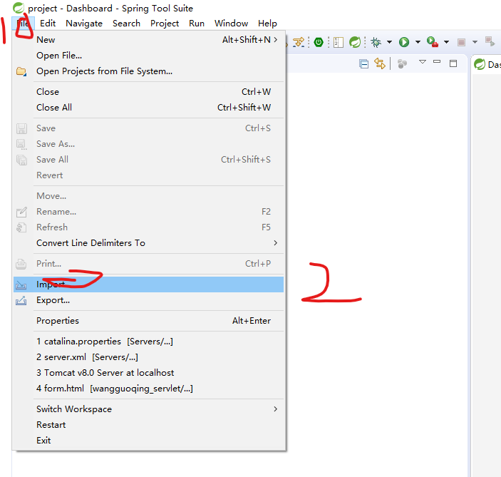
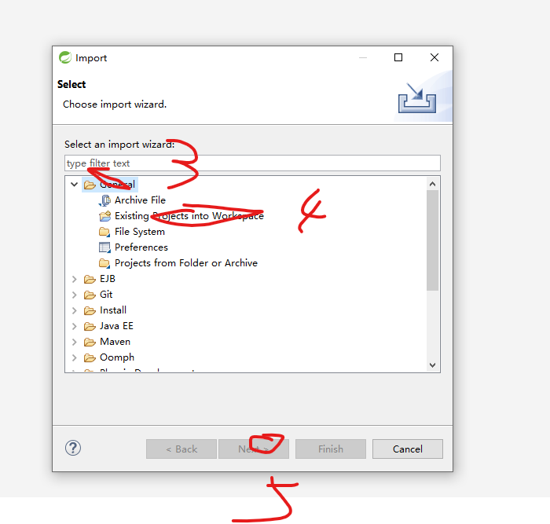
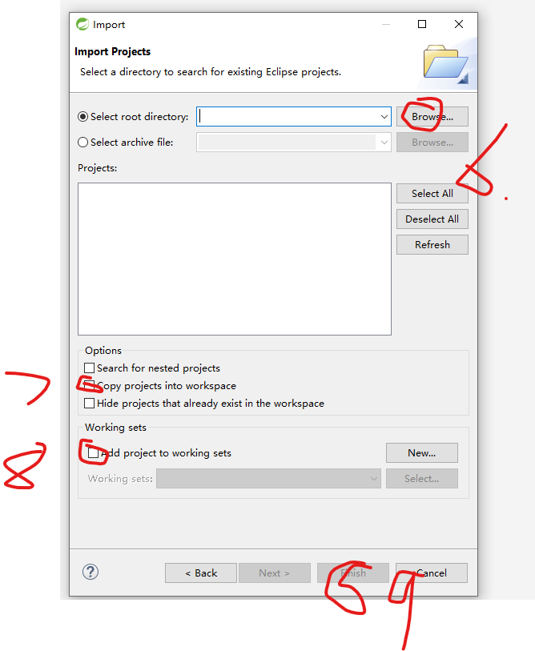

此时，我们可以在左侧看到我们导入的项目了。但是由于这是别人的项目，需要重新设置一下jdk：
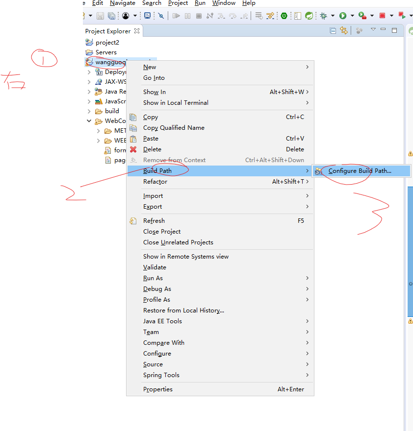
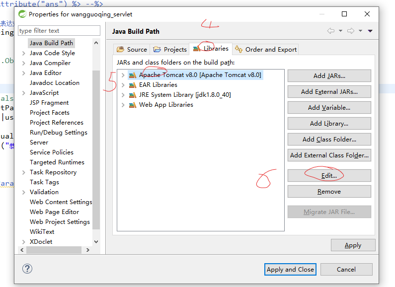
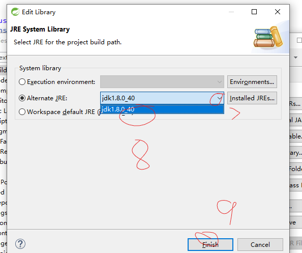

## 2.配置环境
### 2.1 编码问题
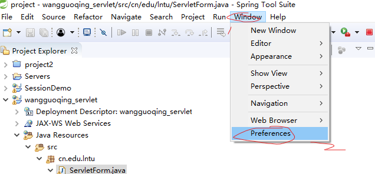
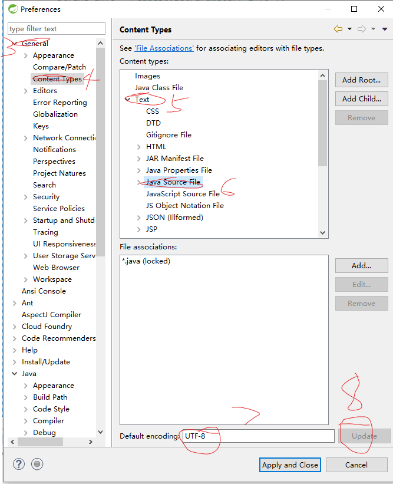
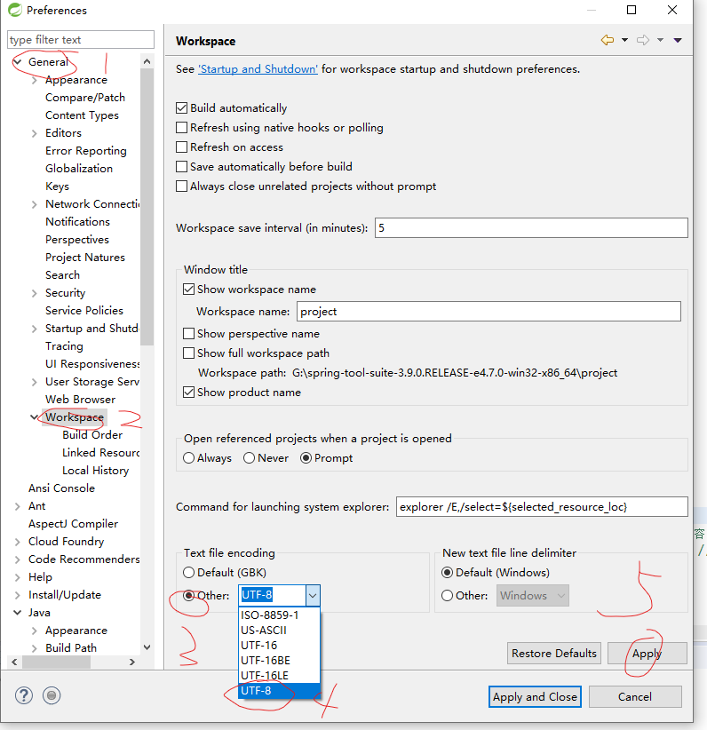
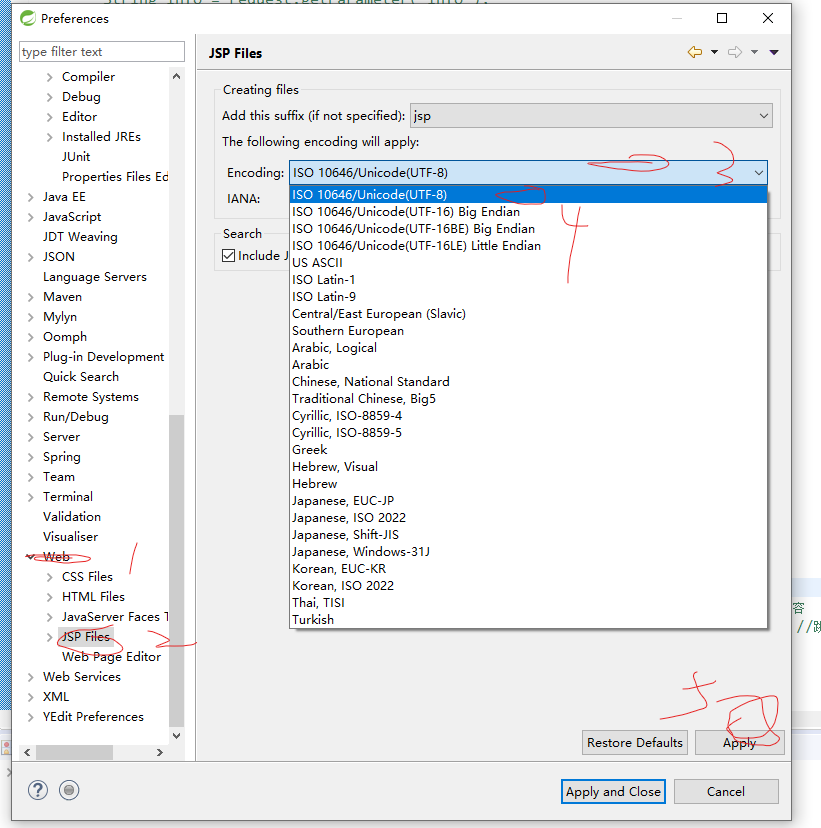

### 2.2 tomcat

....

### 2.3maven

## 3.小技巧：
### 3.1 一键对齐：Ctrl+Shift+F
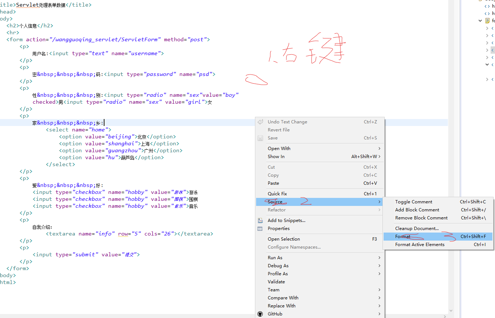

### 3.2 复制实现类类名：
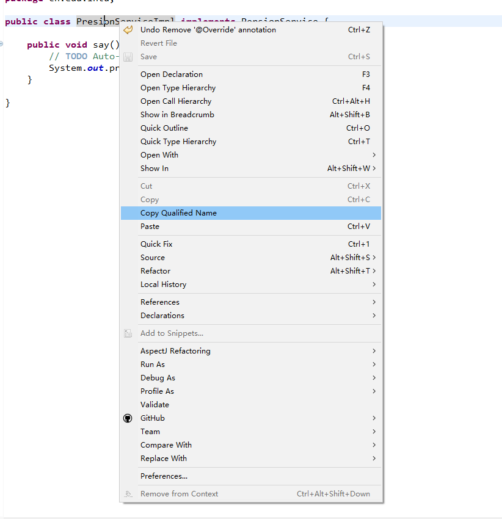

### 3.3 一键导包：ctrl+shift+m

## 4.我遇到的问题
### 4.1 String类型的比较
当我们比较俩个String类型的时候，可以使用equals。如，我们想比较name的值是不是"绣花锤头"：
```java
name.equals("绣花锤头")
```
我们在比较的时候需要注意：
- "=="在Java中是比较俩个基本数据对象的数值，和引用数据类型的地址。故不可以使用"=="将一个其他包获取到与刚刚定义的变量比较 。   
此时如果"name"为null的话会报空指针错误。要判断"name"是否为null，我们可以试一试以下语句。
```java
boolean a;
a = (name != null) && (!name.equals(""));
```
或者为：
```java
boolean a;
a = Objects.name.equals(usne,null);
```
- 当我们要使用他时，需要先调用Objects的包，使用语句：java.util.Objects


### 4.2 全线爆红
当我们导入其他人的项目的时候，容易全线爆红，所有的文件都显示错误，这时候我们就该重新配置一下Java的库：


### 4.3  404错误
请先判断到底是哪个网页打不开，确定之后找之前页面的**转跳语句**。容易出现错误的有：  
1. html文件：  
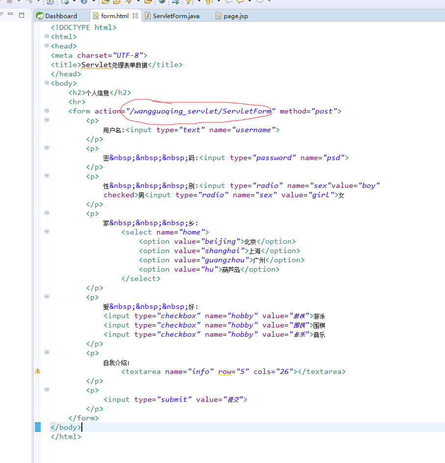
    - 需要注意的是最后面的那个不一定是.java的文件名，也有可能是请求名。如：
    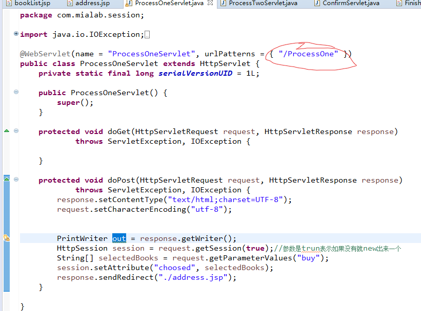
    
2. 跳转语句：

### 4.4   maven无法找到用户里的".m2"文件：
1. 用注释符：
```java
<!--    -->
```
注释掉maven里conf文件夹里settings.xml文件里的：
```java
<localRepository>`路径`\maven_repository</localRepository>
```
如：
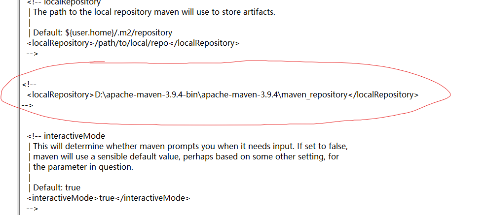

2. 在cmd中运行：
```java
mvn help:system
```

内容真正手打，请耐心等待


[项目参考](https://pan.baidu.com/s/1rzaIMG-dx598ELU-tfnqGg?pwd=mb5b)  
 
提取码：mb5b 
